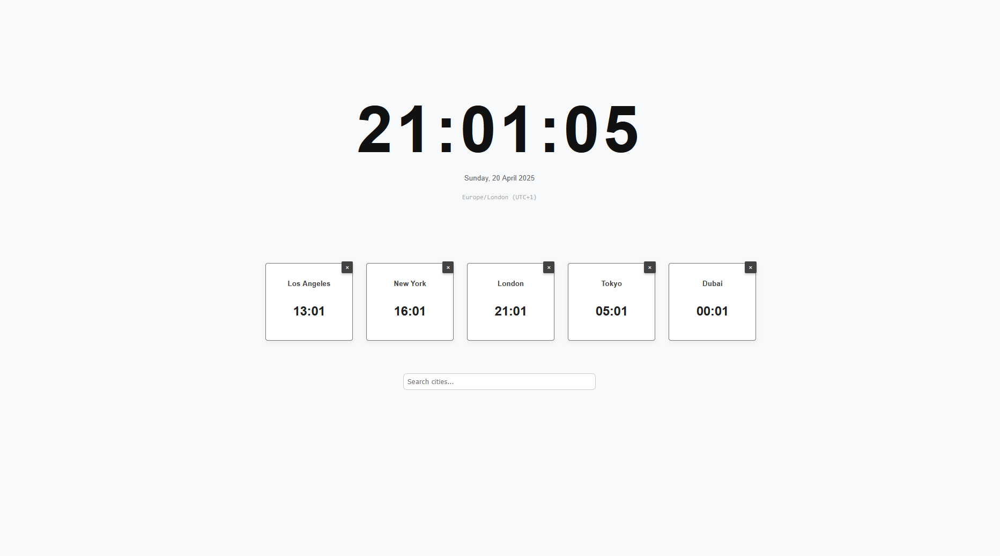

# 🕒 World Clock App

A sleek, responsive web app built with **Svelte** that shows your **local time** along with clocks from **cities around the world**.

## 🌍 Features

- 🕰 Real-time local clock with date and timezone
- 🌐 Add up to **5 international city clocks**
- 🔎 Search cities by name, country, or timezone
- ❌ Easily remove cities from your list
- 📱 Fully responsive layout for mobile & desktop
- 🎨 Smooth modern UI with optional fade-in animations

---

## 📸 Preview



---

## 🚀 Getting Started

### 1. Clone the repo

```bash
git clone https://github.com/yourusername/world-clock-app.git
cd world-clock-app
```

### 2. Install dependencies

```bash
npm install
```

### 3. Run in development

```bash
npm run dev
```

### 4. Build for production

```bash
npm run build
```

---

## 📁 Project Structure

```explorer
src/
├── components/
│   ├── Clock.svelte        # Local clock
│   ├── CityClock.svelte    # Individual world clock
│   └── Search.svelte       # City search component
├── utils/
│   ├── search.ts           # City search dataset
│   └── utcOffset.ts        # Timezone offset helper
├── App.svelte              # Main app layout
└── main.ts                 # App entry point
```

---

## 🛠 Technologies

- [Svelte](https://svelte.dev/)
- TypeScript
- SCSS
- Flexbox for layout
- Intl.DateTimeFormat for time rendering

---

## 📄 License

MIT — feel free to use and adapt.

---

## 🙌 Credits

Developed by ArcadesProject. Inspired by the need to keep track of global timezones in a clean, fast, and intuitive way.
